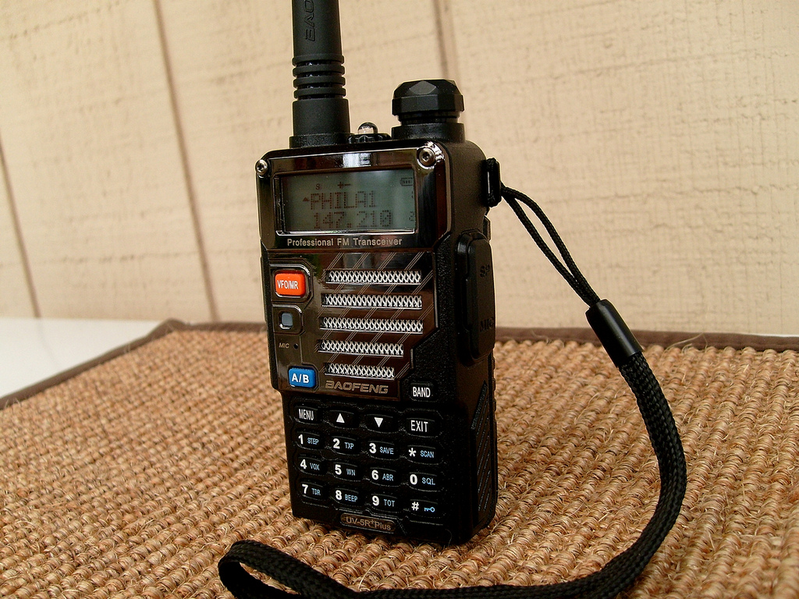

# Chirp Files

A personal collection of notable VHF and UHF frequencies around the Philadelphia area saved as CSVs and [CHIRP radio image files](https://chirp.danplanet.com/projects/chirp/wiki/Home) for the infamous Baofeng UV-5R radio.


> Image CC BY 2.0 James Case

These frequencies have been compiled from various sources. Mainly:

- [radioreference.com](https://www.radioreference.com/)
- Geo-indexed searches against the FCC license database using [spectrum-wrangler-docker](https://github.com/brannondorsey/spectrum-wrangler-docker)
- Scanning arbitrary frequencies between 136-174Mhz and 400-520Mhz

```bash
# note this tree is subject to change with new commits. This list may not be accurate.
philadelphia
├── csv # CSVs are more useful than .img files if you don't have a UV-5R. Use this for reference!
│   ├── confirmed-in-use.csv # frequencies that I've personally heard from West Philly. These are pretty active...
│   ├── radio-reference # files pulled from radioreference.com in August 2018
│   │   ├── all-philadelphia-county-2.csv
│   │   ├── all-philadelphia-county.csv
│   │   ├── businesses.csv
│   │   ├── intl-airport.csv
│   │   ├── radio-reference-philadelphia-zip-19143-1.csv
│   │   ├── radio-reference-philadelphia-zip-19143-zip.csv
│   │   └── sports-stadiums.csv
│   └── west-philadelphia-5km-136MHz-174MHz-and-400MHz-520MHz.csv # 5km of licenses around Squirrel Hill as of August 2018
└── imgs # CHIRP image files. Can be uploaded directly to a radio for scanning.
    └── baofeng-uv-5r # image files specifically for the Baofeng UV-5R
        ├── choppers.img # News helicopter comm channels. CBS ch 3 chopper is very active!
        ├── fcc-1.img # FCC licenses for UHF and VHF withing 5km of West Philly. Downloaded via spectrum-wrangler.
        ├── fcc-2.img # ...
        ├── MURS-FRS-GMRS.img # standard MURS, FRS, and GMRS radio frequencies. Not specific to Philly.
        ├── philadelphia-HAM.img # a collection of amateur radio frequencies around Philly
        ├── radio-reference-philadelphia-zip-19143-1.img # all of the Philly freqs freom radio reference saved as UV-5R image files.
        ├── radio-reference-philadelphia-zip-19143-2.img
        └── radio-reference-philadelphia-zip-19143-3.img
empty-chirp-file.csv # an empty CHIRP file exported to CSV. Use this as a template to create new CSVs that can be imported to CHIRP.
stock-baofeng-uv-5r-channels.img # A stock UV-5R CHIRP image downloaded from a brand new radio. Use this as a template.
```

If this kind of thing is your jam, you should check out the new [https://networksofphilly.org/](Networks of Philly) project, inspired by Ingrid Burrington's [Networks of New York](http://seeingnetworks.in/nyc/) project.